# 🔄 Diagramas de Sequência - ERP Runas

**Data**: 2026-05-21  
**Versão**: 1.0.0  
**Status**: ✅ Documentação Completa

---

## 📑 Índice

1. [Operações de Cliente](#1-operações-de-cliente)
2. [Operações de Produto](#2-operações-de-produto)
3. [Operações de Estoque](#3-operações-de-estoque)
4. [Fluxos Integrados](#4-fluxos-integrados)

---

## 1. Operações de Cliente

### 1.1. Criar Cliente (POST /api/clientes)

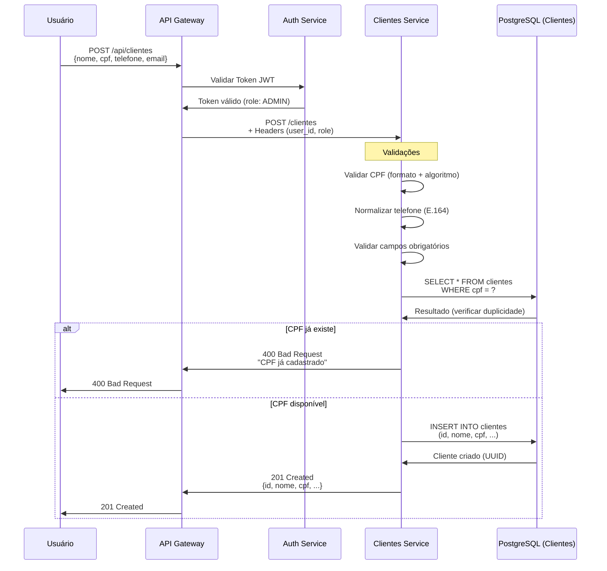
```mermaid
sequenceDiagram
    participant U as Usuário
    participant G as API Gateway
    participant A as Auth Service
    participant C as Clientes Service
    participant DB as PostgreSQL (Clientes)
    
    U->>G: POST /api/clientes<br/>{nome, cpf, telefone, email}
    G->>A: Validar Token JWT
    A->>G: Token válido (role: ADMIN)
    
    G->>C: POST /clientes<br/>+ Headers (user_id, role)
    
    Note over C: Validações
    C->>C: Validar CPF (formato + algoritmo)
    C->>C: Normalizar telefone (E.164)
    C->>C: Validar campos obrigatórios
    
    C->>DB: SELECT * FROM clientes<br/>WHERE cpf = ?
    DB->>C: Resultado (verificar duplicidade)
    
    alt CPF já existe
        C->>G: 400 Bad Request<br/>"CPF já cadastrado"
        G->>U: 400 Bad Request
    else CPF disponível
        C->>DB: INSERT INTO clientes<br/>(id, nome, cpf, ...)
        DB->>C: Cliente criado (UUID)
        
        C->>G: 201 Created<br/>{id, nome, cpf, ...}
        G->>U: 201 Created
    end
```


### 1.2. Listar Clientes (GET /api/clientes)

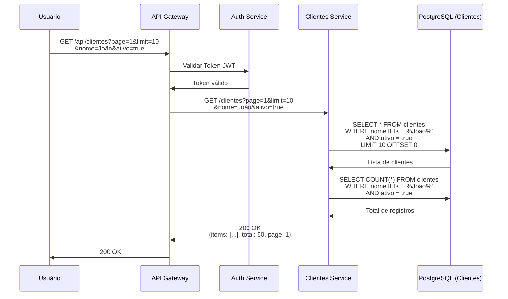
```mermaid
sequenceDiagram
    participant U as Usuário
    participant G as API Gateway
    participant A as Auth Service
    participant C as Clientes Service
    participant DB as PostgreSQL (Clientes)
    
    U->>G: GET /api/clientes?page=1&limit=10<br/>&nome=João&ativo=true
    G->>A: Validar Token JWT
    A->>G: Token válido
    
    G->>C: GET /clientes?page=1&limit=10<br/>&nome=João&ativo=true
    
    C->>DB: SELECT * FROM clientes<br/>WHERE nome ILIKE '%João%'<br/>AND ativo = true<br/>LIMIT 10 OFFSET 0
    DB->>C: Lista de clientes
    
    C->>DB: SELECT COUNT(*) FROM clientes<br/>WHERE nome ILIKE '%João%'<br/>AND ativo = true
    DB->>C: Total de registros
    
    C->>G: 200 OK<br/>{items: [...], total: 50, page: 1}
    G->>U: 200 OK
```

### 1.3. Buscar Cliente por ID (GET /api/clientes/{id})

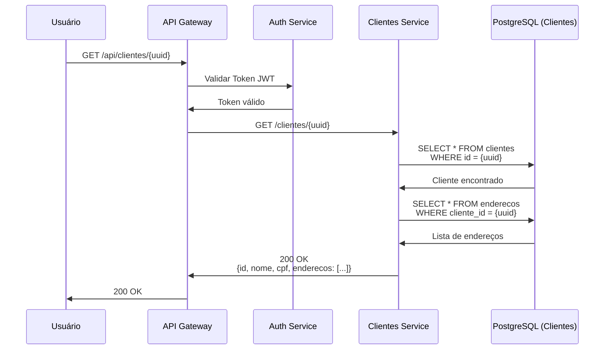
```mermaid
sequenceDiagram
    participant U as Usuário
    participant G as API Gateway
    participant A as Auth Service
    participant C as Clientes Service
    participant DB as PostgreSQL (Clientes)
    
    U->>G: GET /api/clientes/{uuid}
    G->>A: Validar Token JWT
    A->>G: Token válido
    
    G->>C: GET /clientes/{uuid}
    
    C->>DB: SELECT * FROM clientes<br/>WHERE id = {uuid}
    DB->>C: Cliente encontrado
    
    C->>DB: SELECT * FROM enderecos<br/>WHERE cliente_id = {uuid}
    DB->>C: Lista de endereços
    
    C->>G: 200 OK<br/>{id, nome, cpf, enderecos: [...]}
    G->>U: 200 OK
```


### 1.4. Atualizar Cliente (PUT /api/clientes/{id})

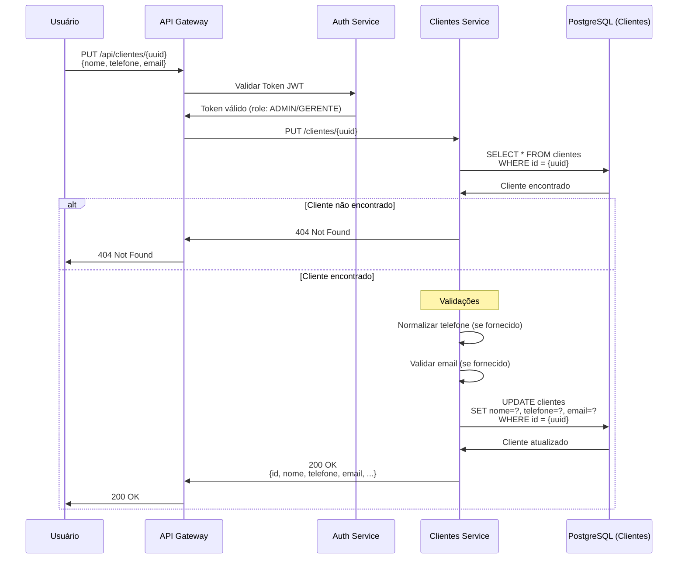
```mermaid
sequenceDiagram
    participant U as Usuário
    participant G as API Gateway
    participant A as Auth Service
    participant C as Clientes Service
    participant DB as PostgreSQL (Clientes)
    
    U->>G: PUT /api/clientes/{uuid}<br/>{nome, telefone, email}
    G->>A: Validar Token JWT
    A->>G: Token válido (role: ADMIN/GERENTE)
    
    G->>C: PUT /clientes/{uuid}
    
    C->>DB: SELECT * FROM clientes<br/>WHERE id = {uuid}
    DB->>C: Cliente encontrado
    
    alt Cliente não encontrado
        C->>G: 404 Not Found
        G->>U: 404 Not Found
    else Cliente encontrado
        Note over C: Validações
        C->>C: Normalizar telefone (se fornecido)
        C->>C: Validar email (se fornecido)
        
        C->>DB: UPDATE clientes<br/>SET nome=?, telefone=?, email=?<br/>WHERE id = {uuid}
        DB->>C: Cliente atualizado
        
        C->>G: 200 OK<br/>{id, nome, telefone, email, ...}
        G->>U: 200 OK
    end
```

### 1.5. Adicionar Endereço (POST /api/clientes/{id}/enderecos)

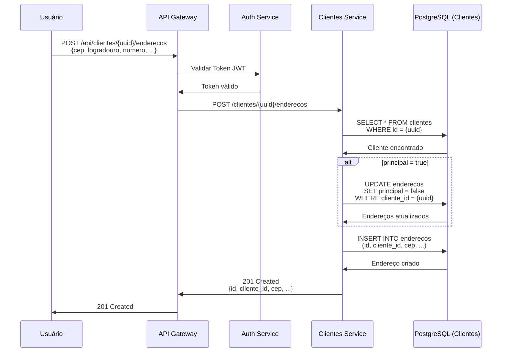
```mermaid
sequenceDiagram
    participant U as Usuário
    participant G as API Gateway
    participant A as Auth Service
    participant C as Clientes Service
    participant DB as PostgreSQL (Clientes)
    
    U->>G: POST /api/clientes/{uuid}/enderecos<br/>{cep, logradouro, numero, ...}
    G->>A: Validar Token JWT
    A->>G: Token válido
    
    G->>C: POST /clientes/{uuid}/enderecos
    
    C->>DB: SELECT * FROM clientes<br/>WHERE id = {uuid}
    DB->>C: Cliente encontrado
    
    alt principal = true
        C->>DB: UPDATE enderecos<br/>SET principal = false<br/>WHERE cliente_id = {uuid}
        DB->>C: Endereços atualizados
    end
    
    C->>DB: INSERT INTO enderecos<br/>(id, cliente_id, cep, ...)
    DB->>C: Endereço criado
    
    C->>G: 201 Created<br/>{id, cliente_id, cep, ...}
    G->>U: 201 Created
```


### 1.6. Desativar Cliente (DELETE /api/clientes/{id})

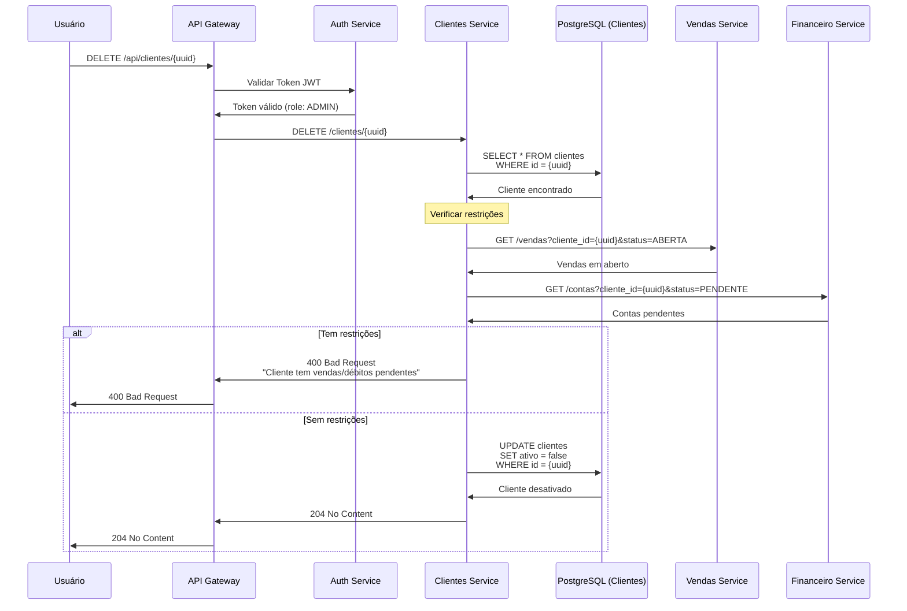
```mermaid
sequenceDiagram
    participant U as Usuário
    participant G as API Gateway
    participant A as Auth Service
    participant C as Clientes Service
    participant DB as PostgreSQL (Clientes)
    participant V as Vendas Service
    participant F as Financeiro Service
    
    U->>G: DELETE /api/clientes/{uuid}
    G->>A: Validar Token JWT
    A->>G: Token válido (role: ADMIN)
    
    G->>C: DELETE /clientes/{uuid}
    
    C->>DB: SELECT * FROM clientes<br/>WHERE id = {uuid}
    DB->>C: Cliente encontrado
    
    Note over C: Verificar restrições
    C->>V: GET /vendas?cliente_id={uuid}&status=ABERTA
    V->>C: Vendas em aberto
    
    C->>F: GET /contas?cliente_id={uuid}&status=PENDENTE
    F->>C: Contas pendentes
    
    alt Tem restrições
        C->>G: 400 Bad Request<br/>"Cliente tem vendas/débitos pendentes"
        G->>U: 400 Bad Request
    else Sem restrições
        C->>DB: UPDATE clientes<br/>SET ativo = false<br/>WHERE id = {uuid}
        DB->>C: Cliente desativado
        
        C->>G: 204 No Content
        G->>U: 204 No Content
    end
```

---

## 2. Operações de Produto

### 2.1. Criar Produto (POST /api/produtos)

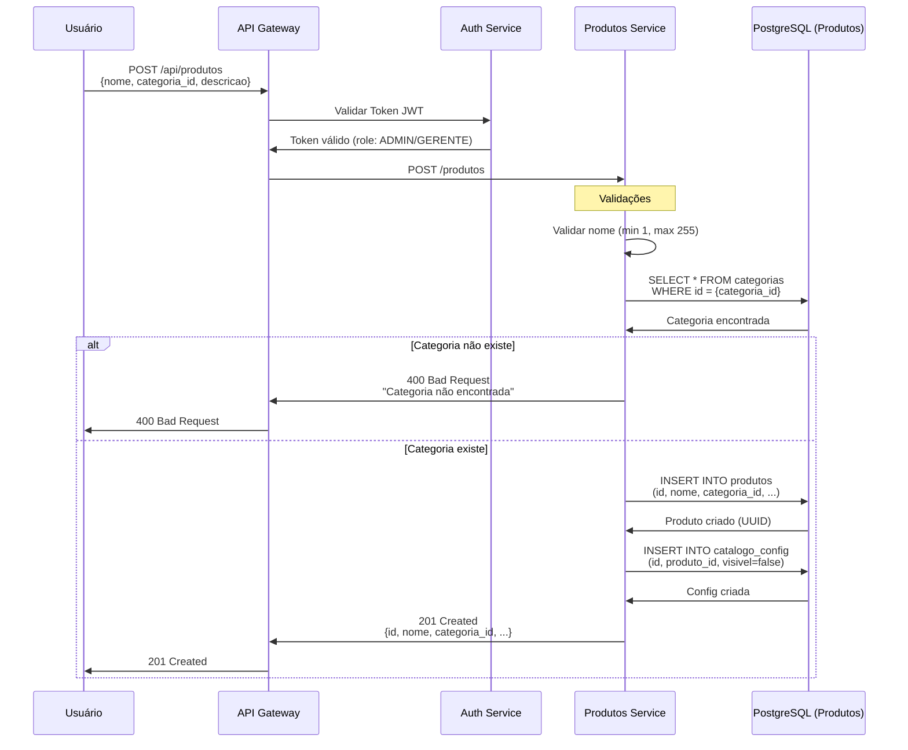
```mermaid
sequenceDiagram
    participant U as Usuário
    participant G as API Gateway
    participant A as Auth Service
    participant P as Produtos Service
    participant DB as PostgreSQL (Produtos)
    
    U->>G: POST /api/produtos<br/>{nome, categoria_id, descricao}
    G->>A: Validar Token JWT
    A->>G: Token válido (role: ADMIN/GERENTE)
    
    G->>P: POST /produtos
    
    Note over P: Validações
    P->>P: Validar nome (min 1, max 255)
    
    P->>DB: SELECT * FROM categorias<br/>WHERE id = {categoria_id}
    DB->>P: Categoria encontrada
    
    alt Categoria não existe
        P->>G: 400 Bad Request<br/>"Categoria não encontrada"
        G->>U: 400 Bad Request
    else Categoria existe
        P->>DB: INSERT INTO produtos<br/>(id, nome, categoria_id, ...)
        DB->>P: Produto criado (UUID)
        
        P->>DB: INSERT INTO catalogo_config<br/>(id, produto_id, visivel=false)
        DB->>P: Config criada
        
        P->>G: 201 Created<br/>{id, nome, categoria_id, ...}
        G->>U: 201 Created
    end
```


### 2.2. Criar Variante (POST /api/produtos/{id}/variantes)

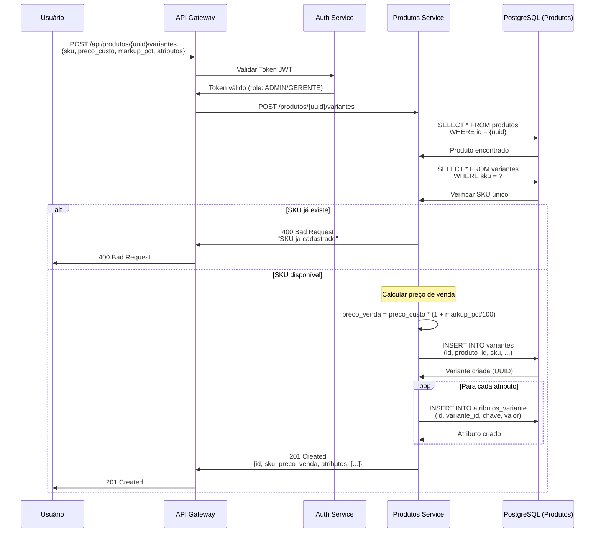
```mermaid
sequenceDiagram
    participant U as Usuário
    participant G as API Gateway
    participant A as Auth Service
    participant P as Produtos Service
    participant DB as PostgreSQL (Produtos)
    
    U->>G: POST /api/produtos/{uuid}/variantes<br/>{sku, preco_custo, markup_pct, atributos}
    G->>A: Validar Token JWT
    A->>G: Token válido (role: ADMIN/GERENTE)
    
    G->>P: POST /produtos/{uuid}/variantes
    
    P->>DB: SELECT * FROM produtos<br/>WHERE id = {uuid}
    DB->>P: Produto encontrado
    
    P->>DB: SELECT * FROM variantes<br/>WHERE sku = ?
    DB->>P: Verificar SKU único
    
    alt SKU já existe
        P->>G: 400 Bad Request<br/>"SKU já cadastrado"
        G->>U: 400 Bad Request
    else SKU disponível
        Note over P: Calcular preço de venda
        P->>P: preco_venda = preco_custo * (1 + markup_pct/100)
        
        P->>DB: INSERT INTO variantes<br/>(id, produto_id, sku, ...)
        DB->>P: Variante criada (UUID)
        
        loop Para cada atributo
            P->>DB: INSERT INTO atributos_variante<br/>(id, variante_id, chave, valor)
            DB->>P: Atributo criado
        end
        
        P->>G: 201 Created<br/>{id, sku, preco_venda, atributos: [...]}
        G->>U: 201 Created
    end
```


### 2.3. Listar Produtos com Filtros (GET /api/produtos)

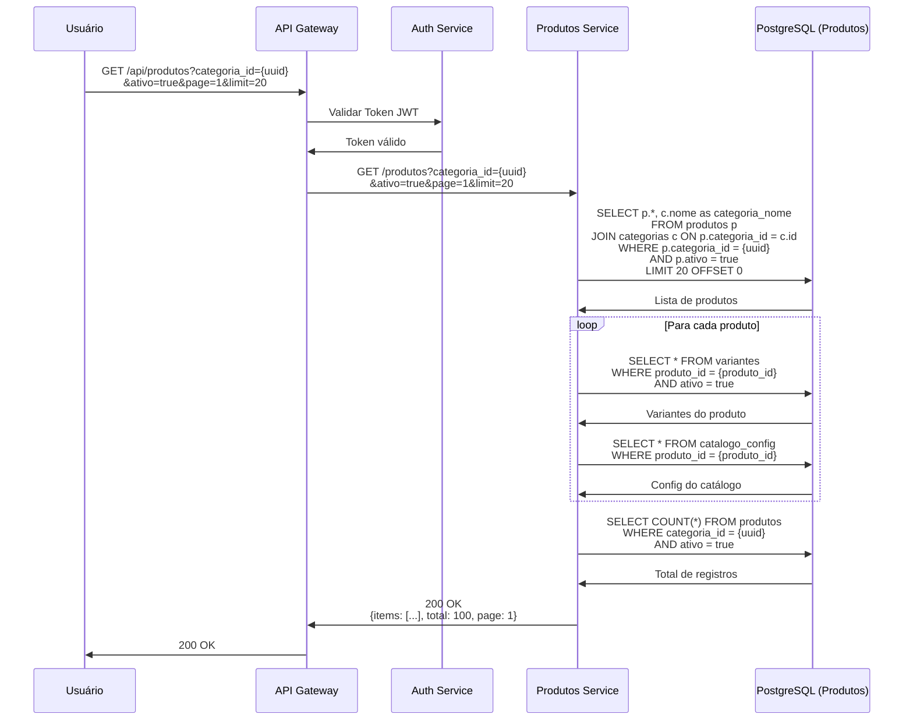
```mermaid
sequenceDiagram
    participant U as Usuário
    participant G as API Gateway
    participant A as Auth Service
    participant P as Produtos Service
    participant DB as PostgreSQL (Produtos)
    
    U->>G: GET /api/produtos?categoria_id={uuid}<br/>&ativo=true&page=1&limit=20
    G->>A: Validar Token JWT
    A->>G: Token válido
    
    G->>P: GET /produtos?categoria_id={uuid}<br/>&ativo=true&page=1&limit=20
    
    P->>DB: SELECT p.*, c.nome as categoria_nome<br/>FROM produtos p<br/>JOIN categorias c ON p.categoria_id = c.id<br/>WHERE p.categoria_id = {uuid}<br/>AND p.ativo = true<br/>LIMIT 20 OFFSET 0
    DB->>P: Lista de produtos
    
    loop Para cada produto
        P->>DB: SELECT * FROM variantes<br/>WHERE produto_id = {produto_id}<br/>AND ativo = true
        DB->>P: Variantes do produto
        
        P->>DB: SELECT * FROM catalogo_config<br/>WHERE produto_id = {produto_id}
        DB->>P: Config do catálogo
    end
    
    P->>DB: SELECT COUNT(*) FROM produtos<br/>WHERE categoria_id = {uuid}<br/>AND ativo = true
    DB->>P: Total de registros
    
    P->>G: 200 OK<br/>{items: [...], total: 100, page: 1}
    G->>U: 200 OK
```


### 2.4. Vincular Fornecedor ao Produto (POST /api/fornecedores-produtos)

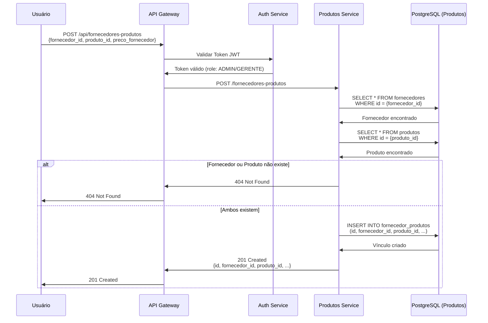
```mermaid
sequenceDiagram
    participant U as Usuário
    participant G as API Gateway
    participant A as Auth Service
    participant P as Produtos Service
    participant DB as PostgreSQL (Produtos)
    
    U->>G: POST /api/fornecedores-produtos<br/>{fornecedor_id, produto_id, preco_fornecedor}
    G->>A: Validar Token JWT
    A->>G: Token válido (role: ADMIN/GERENTE)
    
    G->>P: POST /fornecedores-produtos
    
    P->>DB: SELECT * FROM fornecedores<br/>WHERE id = {fornecedor_id}
    DB->>P: Fornecedor encontrado
    
    P->>DB: SELECT * FROM produtos<br/>WHERE id = {produto_id}
    DB->>P: Produto encontrado
    
    alt Fornecedor ou Produto não existe
        P->>G: 404 Not Found
        G->>U: 404 Not Found
    else Ambos existem
        P->>DB: INSERT INTO fornecedor_produtos<br/>(id, fornecedor_id, produto_id, ...)
        DB->>P: Vínculo criado
        
        P->>G: 201 Created<br/>{id, fornecedor_id, produto_id, ...}
        G->>U: 201 Created
    end
```

### 2.5. Atualizar Configuração de Catálogo (PUT /api/produtos/{id}/catalogo)

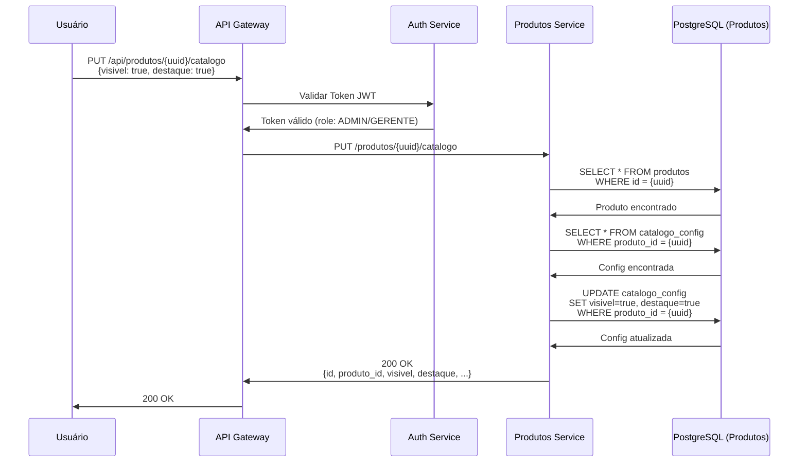
```mermaid
sequenceDiagram
    participant U as Usuário
    participant G as API Gateway
    participant A as Auth Service
    participant P as Produtos Service
    participant DB as PostgreSQL (Produtos)
    
    U->>G: PUT /api/produtos/{uuid}/catalogo<br/>{visivel: true, destaque: true}
    G->>A: Validar Token JWT
    A->>G: Token válido (role: ADMIN/GERENTE)
    
    G->>P: PUT /produtos/{uuid}/catalogo
    
    P->>DB: SELECT * FROM produtos<br/>WHERE id = {uuid}
    DB->>P: Produto encontrado
    
    P->>DB: SELECT * FROM catalogo_config<br/>WHERE produto_id = {uuid}
    DB->>P: Config encontrada
    
    P->>DB: UPDATE catalogo_config<br/>SET visivel=true, destaque=true<br/>WHERE produto_id = {uuid}
    DB->>P: Config atualizada
    
    P->>G: 200 OK<br/>{id, produto_id, visivel, destaque, ...}
    G->>U: 200 OK
```

---

## 3. Operações de Estoque

### 3.1. Criar Registro de Estoque (POST /api/estoque)

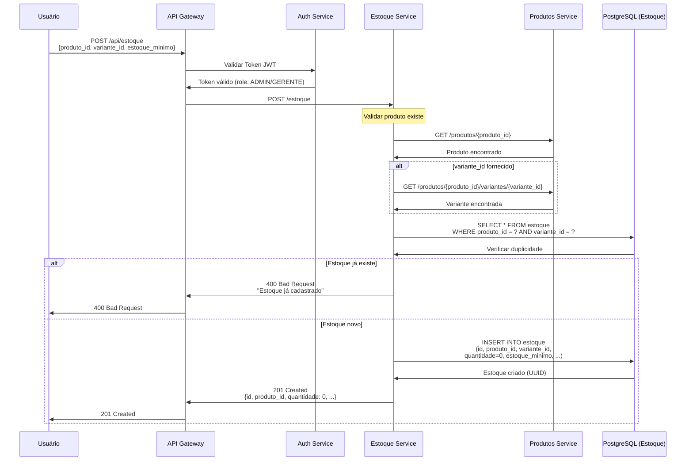
```mermaid
sequenceDiagram
    participant U as Usuário
    participant G as API Gateway
    participant A as Auth Service
    participant E as Estoque Service
    participant P as Produtos Service
    participant DB as PostgreSQL (Estoque)
    
    U->>G: POST /api/estoque<br/>{produto_id, variante_id, estoque_minimo}
    G->>A: Validar Token JWT
    A->>G: Token válido (role: ADMIN/GERENTE)
    
    G->>E: POST /estoque
    
    Note over E: Validar produto existe
    E->>P: GET /produtos/{produto_id}
    P->>E: Produto encontrado
    
    alt variante_id fornecido
        E->>P: GET /produtos/{produto_id}/variantes/{variante_id}
        P->>E: Variante encontrada
    end
    
    E->>DB: SELECT * FROM estoque<br/>WHERE produto_id = ? AND variante_id = ?
    DB->>E: Verificar duplicidade
    
    alt Estoque já existe
        E->>G: 400 Bad Request<br/>"Estoque já cadastrado"
        G->>U: 400 Bad Request
    else Estoque novo
        E->>DB: INSERT INTO estoque<br/>(id, produto_id, variante_id,<br/>quantidade=0, estoque_minimo, ...)
        DB->>E: Estoque criado (UUID)
        
        E->>G: 201 Created<br/>{id, produto_id, quantidade: 0, ...}
        G->>U: 201 Created
    end
```


### 3.2. Entrada de Estoque (POST /api/estoque/entrada)

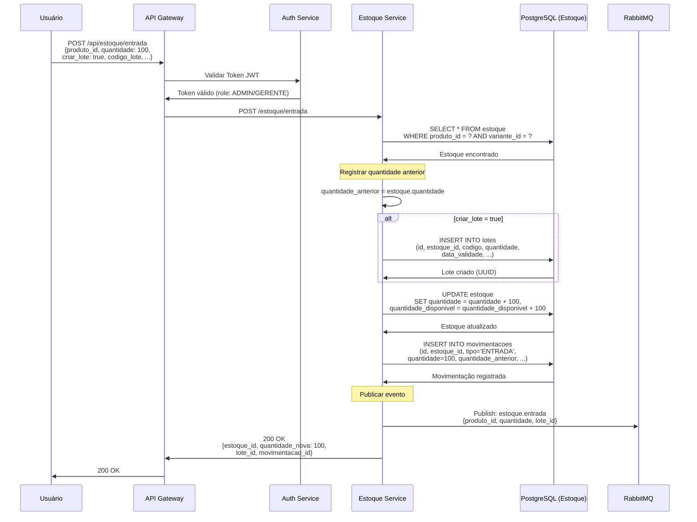
```mermaid
sequenceDiagram
    participant U as Usuário
    participant G as API Gateway
    participant A as Auth Service
    participant E as Estoque Service
    participant DB as PostgreSQL (Estoque)
    participant R as RabbitMQ
    
    U->>G: POST /api/estoque/entrada<br/>{produto_id, quantidade: 100,<br/>criar_lote: true, codigo_lote, ...}
    G->>A: Validar Token JWT
    A->>G: Token válido (role: ADMIN/GERENTE)
    
    G->>E: POST /estoque/entrada
    
    E->>DB: SELECT * FROM estoque<br/>WHERE produto_id = ? AND variante_id = ?
    DB->>E: Estoque encontrado
    
    Note over E: Registrar quantidade anterior
    E->>E: quantidade_anterior = estoque.quantidade
    
    alt criar_lote = true
        E->>DB: INSERT INTO lotes<br/>(id, estoque_id, codigo, quantidade,<br/>data_validade, ...)
        DB->>E: Lote criado (UUID)
    end
    
    E->>DB: UPDATE estoque<br/>SET quantidade = quantidade + 100,<br/>quantidade_disponivel = quantidade_disponivel + 100
    DB->>E: Estoque atualizado
    
    E->>DB: INSERT INTO movimentacoes<br/>(id, estoque_id, tipo='ENTRADA',<br/>quantidade=100, quantidade_anterior, ...)
    DB->>E: Movimentação registrada
    
    Note over E: Publicar evento
    E->>R: Publish: estoque.entrada<br/>{produto_id, quantidade, lote_id}
    
    E->>G: 200 OK<br/>{estoque_id, quantidade_nova: 100,<br/>lote_id, movimentacao_id}
    G->>U: 200 OK
```


### 3.3. Saída de Estoque (POST /api/estoque/saida)

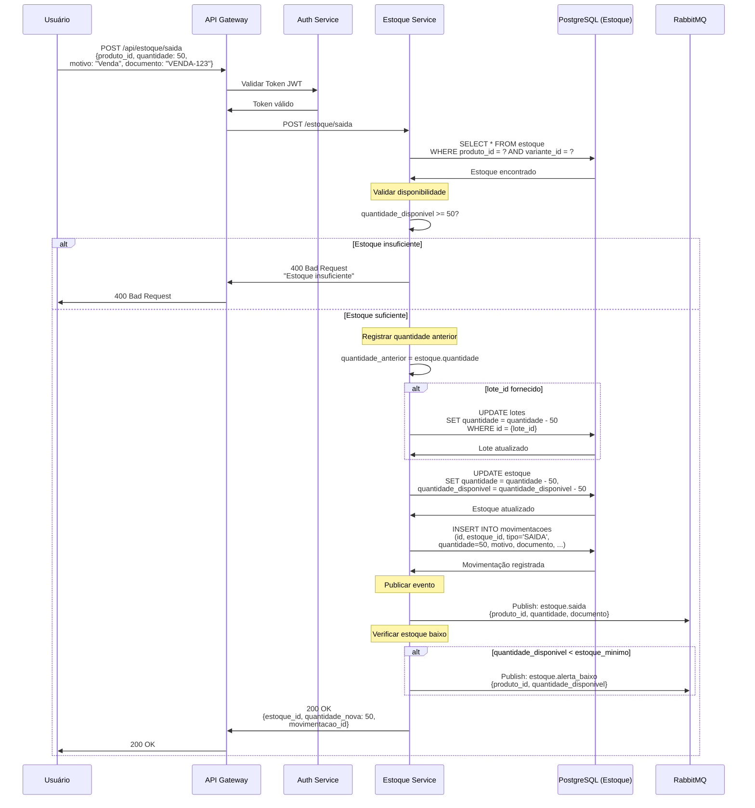
```mermaid
sequenceDiagram
    participant U as Usuário
    participant G as API Gateway
    participant A as Auth Service
    participant E as Estoque Service
    participant DB as PostgreSQL (Estoque)
    participant R as RabbitMQ
    
    U->>G: POST /api/estoque/saida<br/>{produto_id, quantidade: 50,<br/>motivo: "Venda", documento: "VENDA-123"}
    G->>A: Validar Token JWT
    A->>G: Token válido
    
    G->>E: POST /estoque/saida
    
    E->>DB: SELECT * FROM estoque<br/>WHERE produto_id = ? AND variante_id = ?
    DB->>E: Estoque encontrado
    
    Note over E: Validar disponibilidade
    E->>E: quantidade_disponivel >= 50?
    
    alt Estoque insuficiente
        E->>G: 400 Bad Request<br/>"Estoque insuficiente"
        G->>U: 400 Bad Request
    else Estoque suficiente
        Note over E: Registrar quantidade anterior
        E->>E: quantidade_anterior = estoque.quantidade
        
        alt lote_id fornecido
            E->>DB: UPDATE lotes<br/>SET quantidade = quantidade - 50<br/>WHERE id = {lote_id}
            DB->>E: Lote atualizado
        end
        
        E->>DB: UPDATE estoque<br/>SET quantidade = quantidade - 50,<br/>quantidade_disponivel = quantidade_disponivel - 50
        DB->>E: Estoque atualizado
        
        E->>DB: INSERT INTO movimentacoes<br/>(id, estoque_id, tipo='SAIDA',<br/>quantidade=50, motivo, documento, ...)
        DB->>E: Movimentação registrada
        
        Note over E: Publicar evento
        E->>R: Publish: estoque.saida<br/>{produto_id, quantidade, documento}
        
        Note over E: Verificar estoque baixo
        alt quantidade_disponivel < estoque_minimo
            E->>R: Publish: estoque.alerta_baixo<br/>{produto_id, quantidade_disponivel}
        end
        
        E->>G: 200 OK<br/>{estoque_id, quantidade_nova: 50,<br/>movimentacao_id}
        G->>U: 200 OK
    end
```


### 3.4. Reservar Estoque (POST /api/estoque/reservar)

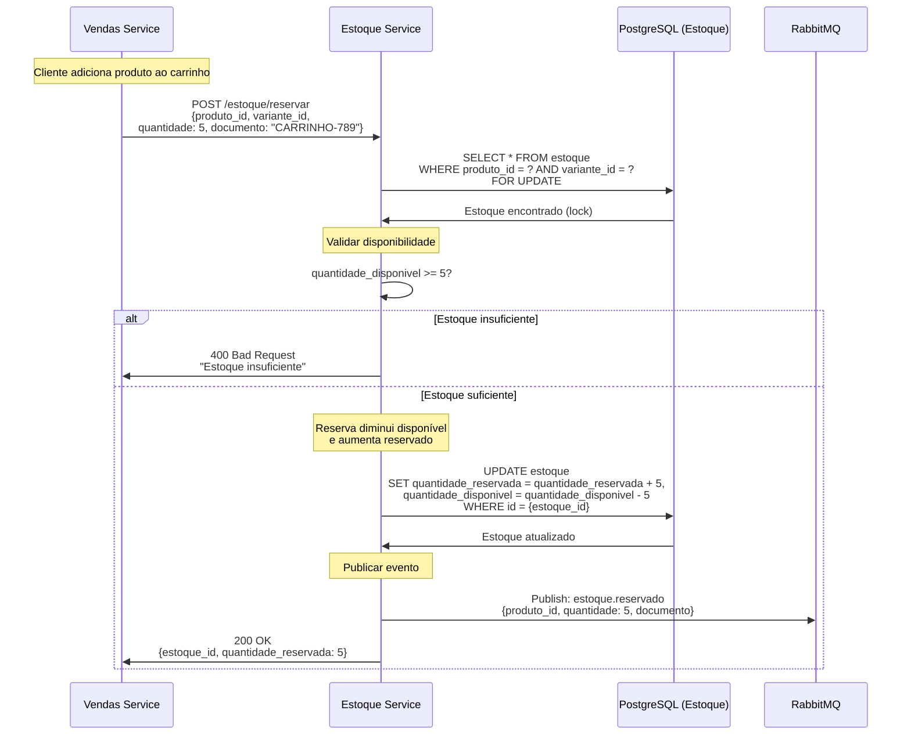
```mermaid
sequenceDiagram
    participant V as Vendas Service
    participant E as Estoque Service
    participant DB as PostgreSQL (Estoque)
    participant R as RabbitMQ
    
    Note over V: Cliente adiciona produto ao carrinho
    V->>E: POST /estoque/reservar<br/>{produto_id, variante_id,<br/>quantidade: 5, documento: "CARRINHO-789"}
    
    E->>DB: SELECT * FROM estoque<br/>WHERE produto_id = ? AND variante_id = ?<br/>FOR UPDATE
    DB->>E: Estoque encontrado (lock)
    
    Note over E: Validar disponibilidade
    E->>E: quantidade_disponivel >= 5?
    
    alt Estoque insuficiente
        E->>V: 400 Bad Request<br/>"Estoque insuficiente"
    else Estoque suficiente
        Note over E: Reserva diminui disponível<br/>e aumenta reservado
        E->>DB: UPDATE estoque<br/>SET quantidade_reservada = quantidade_reservada + 5,<br/>quantidade_disponivel = quantidade_disponivel - 5<br/>WHERE id = {estoque_id}
        DB->>E: Estoque atualizado
        
        Note over E: Publicar evento
        E->>R: Publish: estoque.reservado<br/>{produto_id, quantidade: 5, documento}
        
        E->>V: 200 OK<br/>{estoque_id, quantidade_reservada: 5}
    end
```

### 3.5. Liberar Reserva (POST /api/estoque/liberar-reserva)

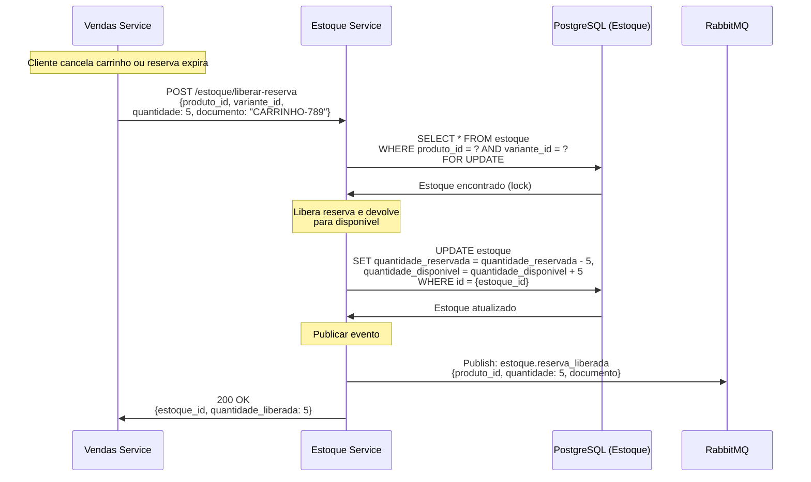
```mermaid
sequenceDiagram
    participant V as Vendas Service
    participant E as Estoque Service
    participant DB as PostgreSQL (Estoque)
    participant R as RabbitMQ
    
    Note over V: Cliente cancela carrinho ou reserva expira
    V->>E: POST /estoque/liberar-reserva<br/>{produto_id, variante_id,<br/>quantidade: 5, documento: "CARRINHO-789"}
    
    E->>DB: SELECT * FROM estoque<br/>WHERE produto_id = ? AND variante_id = ?<br/>FOR UPDATE
    DB->>E: Estoque encontrado (lock)
    
    Note over E: Libera reserva e devolve<br/>para disponível
    E->>DB: UPDATE estoque<br/>SET quantidade_reservada = quantidade_reservada - 5,<br/>quantidade_disponivel = quantidade_disponivel + 5<br/>WHERE id = {estoque_id}
    DB->>E: Estoque atualizado
    
    Note over E: Publicar evento
    E->>R: Publish: estoque.reserva_liberada<br/>{produto_id, quantidade: 5, documento}
    
    E->>V: 200 OK<br/>{estoque_id, quantidade_liberada: 5}
```

### 3.6. Confirmar Reserva (POST /api/estoque/confirmar-reserva)

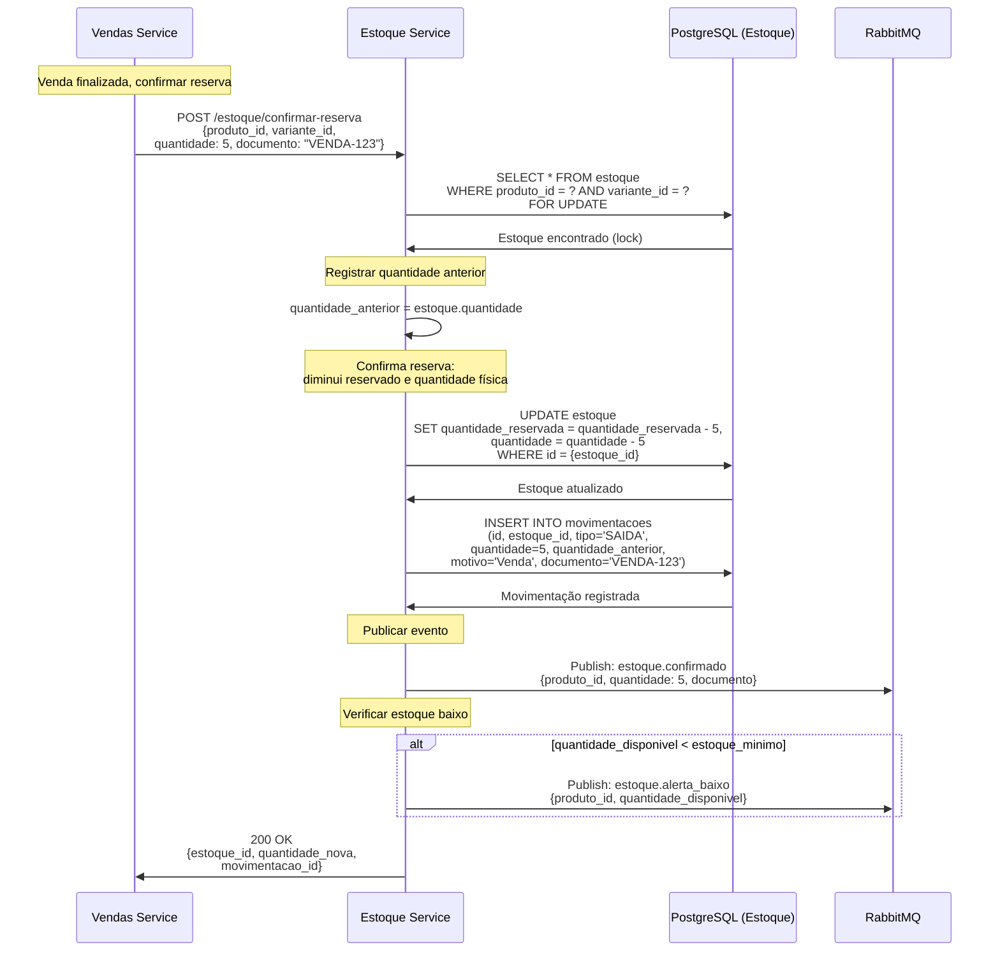
```mermaid
sequenceDiagram
    participant V as Vendas Service
    participant E as Estoque Service
    participant DB as PostgreSQL (Estoque)
    participant R as RabbitMQ
    
    Note over V: Venda finalizada, confirmar reserva
    V->>E: POST /estoque/confirmar-reserva<br/>{produto_id, variante_id,<br/>quantidade: 5, documento: "VENDA-123"}
    
    E->>DB: SELECT * FROM estoque<br/>WHERE produto_id = ? AND variante_id = ?<br/>FOR UPDATE
    DB->>E: Estoque encontrado (lock)
    
    Note over E: Registrar quantidade anterior
    E->>E: quantidade_anterior = estoque.quantidade
    
    Note over E: Confirma reserva:<br/>diminui reservado e quantidade física
    E->>DB: UPDATE estoque<br/>SET quantidade_reservada = quantidade_reservada - 5,<br/>quantidade = quantidade - 5<br/>WHERE id = {estoque_id}
    DB->>E: Estoque atualizado
    
    E->>DB: INSERT INTO movimentacoes<br/>(id, estoque_id, tipo='SAIDA',<br/>quantidade=5, quantidade_anterior,<br/>motivo='Venda', documento='VENDA-123')
    DB->>E: Movimentação registrada
    
    Note over E: Publicar evento
    E->>R: Publish: estoque.confirmado<br/>{produto_id, quantidade: 5, documento}
    
    Note over E: Verificar estoque baixo
    alt quantidade_disponivel < estoque_minimo
        E->>R: Publish: estoque.alerta_baixo<br/>{produto_id, quantidade_disponivel}
    end
    
    E->>V: 200 OK<br/>{estoque_id, quantidade_nova,<br/>movimentacao_id}
```


### 3.7. Realizar Inventário (POST /api/estoque/inventario)

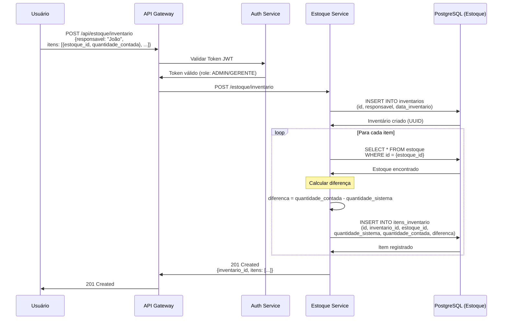
```mermaid
sequenceDiagram
    participant U as Usuário
    participant G as API Gateway
    participant A as Auth Service
    participant E as Estoque Service
    participant DB as PostgreSQL (Estoque)
    
    U->>G: POST /api/estoque/inventario<br/>{responsavel: "João",<br/>itens: [{estoque_id, quantidade_contada}, ...]}
    G->>A: Validar Token JWT
    A->>G: Token válido (role: ADMIN/GERENTE)
    
    G->>E: POST /estoque/inventario
    
    E->>DB: INSERT INTO inventarios<br/>(id, responsavel, data_inventario)
    DB->>E: Inventário criado (UUID)
    
    loop Para cada item
        E->>DB: SELECT * FROM estoque<br/>WHERE id = {estoque_id}
        DB->>E: Estoque encontrado
        
        Note over E: Calcular diferença
        E->>E: diferenca = quantidade_contada - quantidade_sistema
        
        E->>DB: INSERT INTO itens_inventario<br/>(id, inventario_id, estoque_id,<br/>quantidade_sistema, quantidade_contada, diferenca)
        DB->>E: Item registrado
    end
    
    E->>G: 201 Created<br/>{inventario_id, itens: [...]}
    G->>U: 201 Created
```

### 3.8. Finalizar Inventário e Ajustar Estoque (POST /api/estoque/inventario/{id}/finalizar)

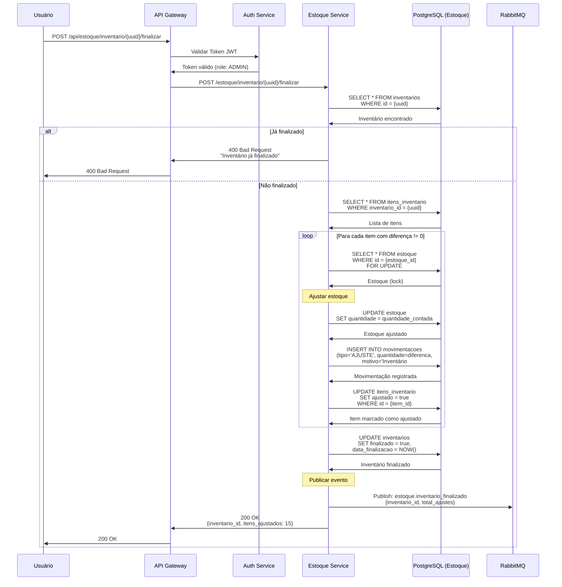
```mermaid
sequenceDiagram
    participant U as Usuário
    participant G as API Gateway
    participant A as Auth Service
    participant E as Estoque Service
    participant DB as PostgreSQL (Estoque)
    participant R as RabbitMQ
    
    U->>G: POST /api/estoque/inventario/{uuid}/finalizar
    G->>A: Validar Token JWT
    A->>G: Token válido (role: ADMIN)
    
    G->>E: POST /estoque/inventario/{uuid}/finalizar
    
    E->>DB: SELECT * FROM inventarios<br/>WHERE id = {uuid}
    DB->>E: Inventário encontrado
    
    alt Já finalizado
        E->>G: 400 Bad Request<br/>"Inventário já finalizado"
        G->>U: 400 Bad Request
    else Não finalizado
        E->>DB: SELECT * FROM itens_inventario<br/>WHERE inventario_id = {uuid}
        DB->>E: Lista de itens
        
        loop Para cada item com diferença != 0
            E->>DB: SELECT * FROM estoque<br/>WHERE id = {estoque_id}<br/>FOR UPDATE
            DB->>E: Estoque (lock)
            
            Note over E: Ajustar estoque
            E->>DB: UPDATE estoque<br/>SET quantidade = quantidade_contada
            DB->>E: Estoque ajustado
            
            E->>DB: INSERT INTO movimentacoes<br/>(tipo='AJUSTE', quantidade=diferenca,<br/>motivo='Inventário #{uuid}')
            DB->>E: Movimentação registrada
            
            E->>DB: UPDATE itens_inventario<br/>SET ajustado = true<br/>WHERE id = {item_id}
            DB->>E: Item marcado como ajustado
        end
        
        E->>DB: UPDATE inventarios<br/>SET finalizado = true,<br/>data_finalizacao = NOW()
        DB->>E: Inventário finalizado
        
        Note over E: Publicar evento
        E->>R: Publish: estoque.inventario_finalizado<br/>{inventario_id, total_ajustes}
        
        E->>G: 200 OK<br/>{inventario_id, itens_ajustados: 15}
        G->>U: 200 OK
    end
```

---

## 3.9. Operações de Carrinho e Pedido

### 3.9.1. Criar Carrinho (POST /api/carrinho)

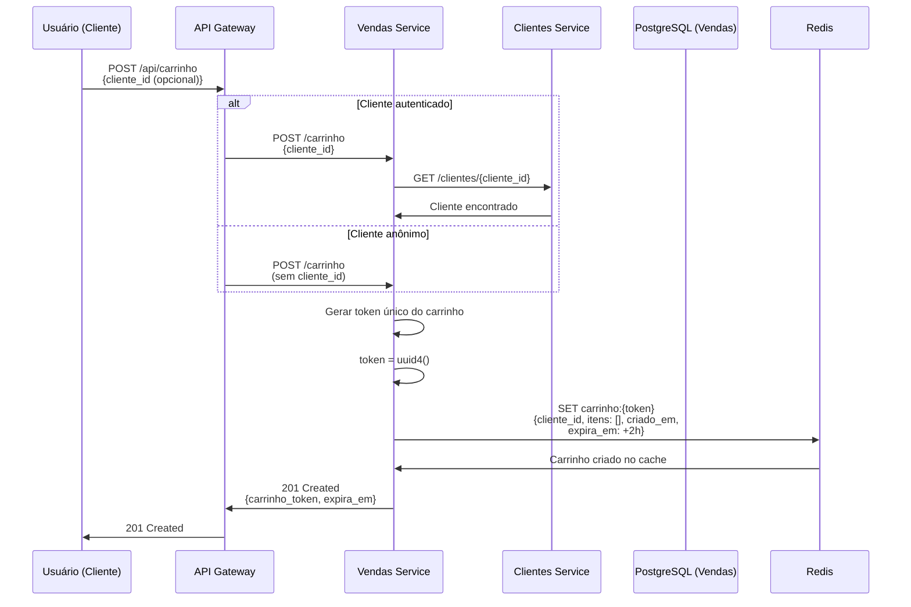
```mermaid
sequenceDiagram
    participant U as Usuário (Cliente)
    participant G as API Gateway
    participant V as Vendas Service
    participant C as Clientes Service
    participant DB as PostgreSQL (Vendas)
    participant R as Redis
    
    U->>G: POST /api/carrinho<br/>{cliente_id (opcional)}
    
    alt Cliente autenticado
        G->>V: POST /carrinho<br/>{cliente_id}
        V->>C: GET /clientes/{cliente_id}
        C->>V: Cliente encontrado
    else Cliente anônimo
        G->>V: POST /carrinho<br/>(sem cliente_id)
    end
    
    V->>V: Gerar token único do carrinho
    V->>V: token = uuid4()
    
    V->>R: SET carrinho:{token}<br/>{cliente_id, itens: [], criado_em,<br/>expira_em: +2h}
    R->>V: Carrinho criado no cache
    
    V->>G: 201 Created<br/>{carrinho_token, expira_em}
    G->>U: 201 Created
```

### 3.9.2. Adicionar Item ao Carrinho (POST /api/carrinho/{token}/itens)

```mermaid
sequenceDiagram
    participant U as Usuário
    participant G as API Gateway
    participant V as Vendas Service
    participant P as Produtos Service
    participant E as Estoque Service
    participant R as Redis
    
    U->>G: POST /api/carrinho/{token}/itens<br/>{produto_id, variante_id, quantidade}
    G->>V: POST /carrinho/{token}/itens
    
    V->>R: GET carrinho:{token}
    R->>V: Dados do carrinho
    
    alt Carrinho não encontrado ou expirado
        V->>G: 404 Not Found<br/>"Carrinho não encontrado"
        G->>U: 404 Not Found
    else Carrinho válido
        Note over V: 1. Validar Produto
        V->>P: GET /produtos/{produto_id}
        P->>V: Produto encontrado e ativo
        
        alt variante_id fornecido
            V->>P: GET /produtos/{produto_id}/variantes/{variante_id}
            P->>V: Variante encontrada e ativa
        end
        
        Note over V: 2. Verificar Disponibilidade
        V->>E: GET /estoque?produto_id={produto_id}<br/>&variante_id={variante_id}
        E->>V: {quantidade_disponivel}
        
        alt Estoque insuficiente
            V->>G: 400 Bad Request<br/>"Estoque insuficiente"
            G->>U: 400 Bad Request
        else Estoque suficiente
            Note over V: 3. Reservar Estoque
            V->>E: POST /estoque/reservar<br/>{produto_id, quantidade,<br/>documento: "CARRINHO-{token}"}
            E->>V: Estoque reservado
            
            Note over V: 4. Adicionar ao Carrinho
            V->>V: Adicionar item ao carrinho<br/>Calcular subtotal e total
            
            V->>R: SET carrinho:{token}<br/>{...carrinho, itens: [...]}
            R->>V: Carrinho atualizado
            
            V->>G: 201 Created<br/>{item_id, subtotal, total_carrinho}
            G->>U: 201 Created
        end
    end
```

### 3.9.3. Remover Item do Carrinho (DELETE /api/carrinho/{token}/itens/{item_id})

```mermaid
sequenceDiagram
    participant U as Usuário
    participant G as API Gateway
    participant V as Vendas Service
    participant E as Estoque Service
    participant R as Redis
    
    U->>G: DELETE /api/carrinho/{token}/itens/{item_id}
    G->>V: DELETE /carrinho/{token}/itens/{item_id}
    
    V->>R: GET carrinho:{token}
    R->>V: Dados do carrinho
    
    V->>V: Encontrar item no carrinho
    
    alt Item não encontrado
        V->>G: 404 Not Found
        G->>U: 404 Not Found
    else Item encontrado
        Note over V: 1. Liberar Reserva de Estoque
        V->>E: POST /estoque/liberar-reserva<br/>{produto_id, quantidade,<br/>documento: "CARRINHO-{token}"}
        E->>V: Reserva liberada
        
        Note over V: 2. Remover do Carrinho
        V->>V: Remover item<br/>Recalcular total
        
        V->>R: SET carrinho:{token}<br/>{...carrinho sem item}
        R->>V: Carrinho atualizado
        
        V->>G: 204 No Content
        G->>U: 204 No Content
    end
```

### 3.9.4. Finalizar Carrinho (Criar Pedido) (POST /api/carrinho/{token}/checkout)

```mermaid
sequenceDiagram
    participant U as Usuário
    participant G as API Gateway
    participant V as Vendas Service
    participant C as Clientes Service
    participant E as Estoque Service
    participant F as Financeiro Service
    participant R as Redis
    participant DB as PostgreSQL (Vendas)
    participant MQ as RabbitMQ
    
    U->>G: POST /api/carrinho/{token}/checkout<br/>{cliente_id, endereco_entrega_id,<br/>forma_pagamento, ...}
    G->>V: POST /carrinho/{token}/checkout
    
    V->>R: GET carrinho:{token}
    R->>V: Dados do carrinho
    
    alt Carrinho vazio
        V->>G: 400 Bad Request<br/>"Carrinho vazio"
        G->>U: 400 Bad Request
    else Carrinho com itens
        Note over V: 1. Validar Cliente
        V->>C: GET /clientes/{cliente_id}
        C->>V: Cliente encontrado e ativo
        
        alt Cliente bloqueado
            V->>G: 400 Bad Request<br/>"Cliente bloqueado"
            G->>U: 400 Bad Request
        end
        
        Note over V: 2. Validar Endereço
        V->>C: GET /clientes/{cliente_id}/enderecos/{endereco_id}
        C->>V: Endereço encontrado
        
        Note over V: 3. Criar Pedido
        V->>DB: INSERT INTO pedidos<br/>(id, cliente_id, status='PENDENTE',<br/>total, itens, ...)
        DB->>V: Pedido criado (UUID)
        
        loop Para cada item
            V->>DB: INSERT INTO itens_pedido<br/>(pedido_id, produto_id, quantidade, ...)
            DB->>V: Item registrado
        end
        
        Note over V: 4. Processar Pagamento
        alt Pagamento à vista (PIX/Cartão)
            V->>V: Gerar cobrança PIX/Cartão
            V->>DB: UPDATE pedidos<br/>SET status='AGUARDANDO_PAGAMENTO'
            DB->>V: Status atualizado
            
        else Pagamento fiado
            V->>C: GET /clientes/{cliente_id}/credito
            C->>V: Crédito disponível
            
            alt Crédito insuficiente
                V->>DB: UPDATE pedidos<br/>SET status='CANCELADO'
                DB->>V: Pedido cancelado
                
                loop Liberar todas as reservas
                    V->>E: POST /estoque/liberar-reserva
                    E->>V: Reserva liberada
                end
                
                V->>G: 400 Bad Request<br/>"Crédito insuficiente"
                G->>U: 400 Bad Request
            else Crédito suficiente
                V->>F: POST /contas-receber<br/>{cliente_id, valor, vencimento}
                F->>V: Conta criada
                
                V->>C: PUT /clientes/{cliente_id}/credito<br/>{debitar: valor}
                C->>V: Crédito debitado
                
                V->>DB: UPDATE pedidos<br/>SET status='CONFIRMADO'
                DB->>V: Pedido confirmado
            end
        end
        
        Note over V: 5. Limpar Carrinho
        V->>R: DEL carrinho:{token}
        R->>V: Carrinho removido
        
        Note over V: 6. Publicar Evento
        V->>MQ: Publish: pedido.criado<br/>{pedido_id, cliente_id, total}
        
        V->>G: 201 Created<br/>{pedido_id, status, total,<br/>link_pagamento (se PIX)}
        G->>U: 201 Created
    end
```

### 3.9.5. Confirmar Pagamento e Converter Pedido em Venda (Webhook)

```mermaid
sequenceDiagram
    participant MP as Mercado Pago
    participant G as API Gateway
    participant V as Vendas Service
    participant E as Estoque Service
    participant DB as PostgreSQL (Vendas)
    participant MQ as RabbitMQ
    
    Note over MP: Cliente pagou via PIX
    MP->>G: POST /webhooks/mercadopago<br/>{payment_id, status: 'approved'}
    G->>V: POST /webhooks/mercadopago
    
    V->>V: Validar assinatura do webhook
    
    V->>DB: SELECT * FROM pedidos<br/>WHERE payment_id = ?
    DB->>V: Pedido encontrado
    
    alt Pagamento aprovado
        V->>DB: UPDATE pedidos<br/>SET status='PAGO'
        DB->>V: Pedido atualizado
        
        Note over V: Converter Pedido em Venda
        V->>DB: INSERT INTO vendas<br/>(id, pedido_id, cliente_id,<br/>status='FINALIZADA', ...)
        DB->>V: Venda criada
        
        loop Para cada item
            Note over V: Confirmar reservas
            V->>E: POST /estoque/confirmar-reserva<br/>{produto_id, quantidade,<br/>documento: "VENDA-{venda_id}"}
            E->>V: Reserva confirmada, estoque baixado
        end
        
        Note over V: Publicar Eventos
        V->>MQ: Publish: venda.finalizada<br/>{venda_id, pedido_id, cliente_id}
        V->>MQ: Publish: pedido.pago<br/>{pedido_id}
        
        V->>G: 200 OK
        G->>MP: 200 OK
        
    else Pagamento recusado
        V->>DB: UPDATE pedidos<br/>SET status='PAGAMENTO_RECUSADO'
        DB->>V: Pedido atualizado
        
        loop Liberar todas as reservas
            V->>E: POST /estoque/liberar-reserva
            E->>V: Reserva liberada
        end
        
        V->>MQ: Publish: pedido.pagamento_recusado
        
        V->>G: 200 OK
        G->>MP: 200 OK
    end
```

### 3.9.6. Cancelar Pedido (POST /api/pedidos/{id}/cancelar)

```mermaid
sequenceDiagram
    participant U as Usuário
    participant G as API Gateway
    participant A as Auth Service
    participant V as Vendas Service
    participant E as Estoque Service
    participant DB as PostgreSQL (Vendas)
    participant MQ as RabbitMQ
    
    U->>G: POST /api/pedidos/{uuid}/cancelar<br/>{motivo}
    G->>A: Validar Token JWT
    A->>G: Token válido (role: ADMIN/GERENTE)
    
    G->>V: POST /pedidos/{uuid}/cancelar
    
    V->>DB: SELECT * FROM pedidos<br/>WHERE id = {uuid}
    DB->>V: Pedido encontrado
    
    alt Pedido já finalizado
        V->>G: 400 Bad Request<br/>"Pedido já finalizado"
        G->>U: 400 Bad Request
    else Pedido pode ser cancelado
        V->>DB: UPDATE pedidos<br/>SET status='CANCELADO',<br/>motivo_cancelamento=?
        DB->>V: Pedido cancelado
        
        loop Para cada item
            Note over V: Liberar reservas
            V->>E: POST /estoque/liberar-reserva<br/>{produto_id, quantidade}
            E->>V: Reserva liberada
        end
        
        alt Pedido fiado (já debitou crédito)
            V->>V: Estornar crédito do cliente
        end
        
        Note over V: Publicar Evento
        V->>MQ: Publish: pedido.cancelado<br/>{pedido_id, motivo}
        
        V->>G: 200 OK<br/>{pedido_id, status: 'CANCELADO'}
        G->>U: 200 OK
    end
```

---

## 4. Fluxos Integrados

### 4.1. Fluxo Completo: Criar Venda com Estoque

```mermaid
sequenceDiagram
    participant U as Usuário
    participant G as API Gateway
    participant A as Auth Service
    participant V as Vendas Service
    participant C as Clientes Service
    participant P as Produtos Service
    participant E as Estoque Service
    participant F as Financeiro Service
    participant R as RabbitMQ
    
    U->>G: POST /api/vendas<br/>{cliente_id, itens: [{produto_id, quantidade}]}
    G->>A: Validar Token JWT
    A->>G: Token válido
    
    G->>V: POST /vendas
    
    Note over V: 1. Validar Cliente
    V->>C: GET /clientes/{cliente_id}
    C->>V: Cliente encontrado e ativo
    
    loop Para cada item
        Note over V: 2. Validar Produto
        V->>P: GET /produtos/{produto_id}
        P->>V: Produto encontrado e ativo
        
        Note over V: 3. Reservar Estoque
        V->>E: POST /estoque/reservar<br/>{produto_id, quantidade}
        E->>V: Estoque reservado
    end
    
    Note over V: 4. Criar Venda
    V->>V: Calcular total da venda
    V->>V: INSERT venda (status: PENDENTE)
    
    Note over V: 5. Processar Pagamento
    alt Pagamento à vista
        V->>V: UPDATE venda (status: PAGA)
        
        loop Para cada item
            Note over V: Confirmar reserva (baixa física)
            V->>E: POST /estoque/confirmar-reserva<br/>{produto_id, quantidade, documento}
            E->>V: Reserva confirmada, estoque baixado
        end
        
        V->>R: Publish: venda.finalizada
        
    else Pagamento fiado
        V->>C: GET /clientes/{cliente_id}/credito
        C->>V: Crédito disponível
        
        alt Crédito insuficiente
            loop Liberar reservas
                V->>E: POST /estoque/liberar-reserva
                E->>V: Reserva liberada
            end
            V->>G: 400 Bad Request<br/>"Crédito insuficiente"
            G->>U: 400 Bad Request
        else Crédito suficiente
            V->>F: POST /contas-receber<br/>{cliente_id, valor, vencimento}
            F->>V: Conta criada
            
            V->>C: PUT /clientes/{cliente_id}/credito<br/>{debitar: valor}
            C->>V: Crédito debitado
            
            loop Para cada item
                Note over V: Confirmar reserva (baixa física)
                V->>E: POST /estoque/confirmar-reserva<br/>{produto_id, quantidade, documento}
                E->>V: Reserva confirmada, estoque baixado
            end
            
            V->>R: Publish: venda.fiada_criada
        end
    end
    
    V->>G: 201 Created<br/>{venda_id, status, total}
    G->>U: 201 Created
```


### 4.2. Fluxo: Alerta de Estoque Baixo com Notificação

```mermaid
sequenceDiagram
    participant E as Estoque Service
    participant R as RabbitMQ
    participant N as Notificações Service
    participant W as WhatsApp (Evolution API)
    participant DB as PostgreSQL (Estoque)
    
    Note over E: Após saída de estoque
    E->>E: Verificar: quantidade_disponivel < estoque_minimo?
    
    alt Estoque abaixo do mínimo
        E->>R: Publish: estoque.alerta_baixo<br/>{produto_id, quantidade_disponivel,<br/>estoque_minimo}
        
        Note over N: Consumer escutando fila
        R->>N: Consume: estoque.alerta_baixo
        
        N->>DB: SELECT * FROM estoque<br/>WHERE id = {estoque_id}
        DB->>N: Dados do estoque
        
        N->>N: Montar mensagem:<br/>"⚠️ Estoque baixo!<br/>Produto: {nome}<br/>Disponível: {qtd}<br/>Mínimo: {min}"
        
        N->>W: POST /message/sendText<br/>{number: gerente_phone, text: ...}
        W->>N: Mensagem enviada
        
        N->>DB: INSERT INTO notificacoes<br/>(tipo: 'ESTOQUE_BAIXO', enviada: true)
        DB->>N: Notificação registrada
    end
```

### 4.3. Fluxo: Verificação de Lotes Vencidos (Job Agendado)

```mermaid
sequenceDiagram
    participant S as Scheduler (Celery)
    participant E as Estoque Service
    participant DB as PostgreSQL (Estoque)
    participant R as RabbitMQ
    participant N as Notificações Service
    
    Note over S: Job executado diariamente às 08:00
    S->>E: Task: verificar_lotes_vencidos()
    
    E->>DB: SELECT * FROM lotes<br/>WHERE data_validade <= CURRENT_DATE<br/>AND status = 'ATIVO'
    DB->>E: Lista de lotes vencidos
    
    loop Para cada lote vencido
        E->>DB: UPDATE lotes<br/>SET status = 'VENCIDO'<br/>WHERE id = {lote_id}
        DB->>E: Lote marcado como vencido
        
        E->>R: Publish: estoque.lote_vencido<br/>{lote_id, produto_id, quantidade}
    end
    
    E->>DB: SELECT * FROM lotes<br/>WHERE data_validade BETWEEN CURRENT_DATE<br/>AND CURRENT_DATE + INTERVAL '7 days'<br/>AND status = 'ATIVO'
    DB->>E: Lotes próximos do vencimento
    
    loop Para cada lote próximo do vencimento
        E->>R: Publish: estoque.lote_proximo_vencimento<br/>{lote_id, produto_id, dias_restantes}
        
        R->>N: Consume: estoque.lote_proximo_vencimento
        N->>N: Enviar notificação WhatsApp
    end
    
    E->>S: Task concluída<br/>{lotes_vencidos: 3, alertas_enviados: 5}
```

---

## 5. Resumo de Padrões e Convenções

### 5.1. Padrões de Autenticação

**Todos os endpoints protegidos seguem o padrão:**
1. Cliente envia request com `Authorization: Bearer {token}`
2. API Gateway valida token com Auth Service
3. Gateway extrai `user_id` e `role` do token
4. Gateway propaga headers para microsserviços downstream
5. Microsserviço processa e retorna resposta

### 5.2. Padrões de Validação

**Ordem de validações:**
1. Validação de autenticação (token válido?)
2. Validação de autorização (role adequada?)
3. Validação de formato (campos obrigatórios, tipos corretos)
4. Validação de negócio (CPF único, SKU único, estoque suficiente)
5. Validação de integridade referencial (FK existem?)

### 5.3. Padrões de Resposta

**Códigos HTTP utilizados:**
- `200 OK` - Operação bem-sucedida (GET, PUT)
- `201 Created` - Recurso criado (POST)
- `204 No Content` - Operação bem-sucedida sem retorno (DELETE)
- `400 Bad Request` - Erro de validação ou regra de negócio
- `401 Unauthorized` - Token inválido ou ausente
- `403 Forbidden` - Sem permissão para a operação
- `404 Not Found` - Recurso não encontrado
- `409 Conflict` - Conflito (ex: CPF duplicado)
- `500 Internal Server Error` - Erro interno do servidor

### 5.4. Padrões de Eventos (RabbitMQ)

**Eventos publicados:**
- `estoque.entrada` - Quando há entrada de mercadoria
- `estoque.saida` - Quando há saída direta de mercadoria (sem reserva)
- `estoque.reservado` - Quando estoque é reservado (carrinho)
- `estoque.reserva_liberada` - Quando reserva é liberada (cancelamento)
- `estoque.confirmado` - Quando reserva é confirmada e estoque baixado (venda)
- `estoque.alerta_baixo` - Quando estoque fica abaixo do mínimo
- `estoque.lote_vencido` - Quando lote vence
- `estoque.lote_proximo_vencimento` - Lote próximo do vencimento
- `estoque.inventario_finalizado` - Inventário concluído
- `pedido.criado` - Pedido criado (carrinho finalizado)
- `pedido.pago` - Pagamento do pedido confirmado
- `pedido.pagamento_recusado` - Pagamento recusado
- `pedido.cancelado` - Pedido cancelado
- `venda.finalizada` - Venda paga e concluída
- `venda.fiada_criada` - Venda fiada registrada
- `venda.cancelada` - Venda cancelada
- `pagamento.recebido` - Pagamento confirmado
- `cliente.bloqueado` - Cliente foi bloqueado

---

## 6. Considerações de Implementação

### 6.1. Gestão de Reservas de Estoque

**Problema**: Evitar baixa dupla de estoque ao usar reservas

**Solução Implementada**:

```
Estado Inicial:
- quantidade = 100
- quantidade_reservada = 0
- quantidade_disponivel = 100

1. Reservar (carrinho):
   quantidade_reservada += 5      → 5
   quantidade_disponivel -= 5     → 95
   quantidade permanece           → 100

2. Confirmar Reserva (venda):
   quantidade_reservada -= 5      → 0
   quantidade -= 5                → 95
   quantidade_disponivel permanece → 95

3. Cancelar (liberar reserva):
   quantidade_reservada -= 5      → 0
   quantidade_disponivel += 5     → 100
   quantidade permanece           → 100
```

**Regras**:
- `quantidade_disponivel = quantidade - quantidade_reservada`
- Reserva NÃO diminui `quantidade` física
- Confirmação diminui `quantidade` física e `quantidade_reservada`
- Cancelamento devolve para `quantidade_disponivel`

**Endpoints**:
- `POST /estoque/reservar` - Reserva para carrinho
- `POST /estoque/confirmar-reserva` - Confirma e baixa estoque (venda)
- `POST /estoque/liberar-reserva` - Cancela reserva
- `POST /estoque/saida` - Saída direta (sem reserva prévia)

### 6.2. Transações Distribuídas

**Problema**: Operações que envolvem múltiplos serviços (ex: venda fiada)

**Solução Atual (MVP)**: 
- Chamadas síncronas sequenciais
- Rollback manual em caso de erro
- Logs detalhados para auditoria

**Solução Futura**:
- Implementar Saga Pattern
- Eventos de compensação
- Idempotência em todos os endpoints

### 6.2. Transações Distribuídas

**Problema**: Operações que envolvem múltiplos serviços (ex: venda fiada)

**Solução Atual (MVP)**: 
- Chamadas síncronas sequenciais
- Rollback manual em caso de erro
- Logs detalhados para auditoria

**Solução Futura**:
- Implementar Saga Pattern
- Eventos de compensação
- Idempotência em todos os endpoints

### 6.3. Consistência Eventual

**Eventos assíncronos** (RabbitMQ) podem ter delay:
- Notificações podem chegar com segundos de atraso
- Alertas de estoque não são em tempo real
- Sistema tolera inconsistência temporária

### 6.3. Locks e Concorrência

**Operações críticas usam locks:**
- Reserva de estoque: `SELECT ... FOR UPDATE`
- Saída de estoque: `SELECT ... FOR UPDATE`
- Ajuste de crédito: `SELECT ... FOR UPDATE`

### 6.4. Idempotência

**Endpoints idempotentes:**
- GET (sempre idempotente)
- PUT (atualização completa)
- DELETE (soft delete)

**Endpoints não-idempotentes:**
- POST (criar recurso)
- Solução: Usar `idempotency-key` header (futuro)

---

## 7. Fluxos de Erro Comuns

### 7.1. Token Expirado

```
Cliente → Gateway: Request com token expirado
Gateway → Auth: Validar token
Auth → Gateway: 401 Token expirado
Gateway → Cliente: 401 Unauthorized
Cliente → Gateway: POST /auth/refresh (refresh_token)
Gateway → Auth: Renovar token
Auth → Gateway: Novo access_token
Gateway → Cliente: 200 OK {access_token}
```

### 7.2. Estoque Insuficiente

```
Cliente → Gateway: POST /vendas (quantidade: 100)
Gateway → Vendas: Criar venda
Vendas → Estoque: Reservar 100 unidades
Estoque → Estoque: Verificar disponibilidade (apenas 50)
Estoque → Vendas: 400 Estoque insuficiente
Vendas → Gateway: 400 Estoque insuficiente
Gateway → Cliente: 400 Bad Request
```

### 7.3. Cliente Bloqueado

```
Cliente → Gateway: POST /vendas (tipo: FIADO)
Gateway → Vendas: Criar venda fiada
Vendas → Clientes: Verificar cliente
Clientes → Vendas: Cliente bloqueado
Vendas → Gateway: 400 Cliente bloqueado
Gateway → Cliente: 400 Bad Request
```

---

## 8. Métricas e Monitoramento

### 8.1. Métricas Importantes

**Por Endpoint:**
- Tempo de resposta (p50, p95, p99)
- Taxa de erro (4xx, 5xx)
- Throughput (requests/segundo)

**Por Serviço:**
- Disponibilidade (uptime)
- Latência de comunicação inter-serviços
- Tamanho da fila de eventos (RabbitMQ)

**Por Operação de Negócio:**
- Tempo médio de criação de venda
- Taxa de falha em reserva de estoque
- Tempo de processamento de inventário

### 8.2. Logs Estruturados

**Todos os serviços usam structlog:**
```json
{
  "timestamp": "2026-05-21T10:30:00Z",
  "service": "estoque",
  "level": "info",
  "event": "estoque.saida",
  "produto_id": "uuid",
  "quantidade": 50,
  "usuario_id": "uuid",
  "request_id": "uuid"
}
```

---

## 9. Próximos Passos

### 9.1. Melhorias nos Diagramas

- [ ] Adicionar fluxos de erro detalhados em todos os diagramas
- [ ] Documentar Saga Pattern para vendas complexas
- [ ] Documentar estratégia de retry e circuit breaker
- [ ] Adicionar diagramas de monitoramento e observabilidade
- [ ] Documentar fluxo de expiração automática de reservas

### 9.2. Novos Fluxos a Documentar

- [ ] Fluxo de devolução de venda
- [ ] Fluxo de transferência entre estoques/depósitos
- [ ] Fluxo de pagamento de conta fiada
- [ ] Fluxo de bloqueio automático de cliente
- [ ] Fluxo de reposição automática de estoque
- [ ] Fluxo de cupom de desconto
- [ ] Fluxo de programa de fidelidade

---

## 📚 Referências

- **Arquitetura**: [docs/ARQUITETURA-COMUNICACAO.md](./ARQUITETURA-COMUNICACAO.md)
- **Regras de Negócio**: [docs/REGRAS-DE-NEGOCIO.md](./REGRAS-DE-NEGOCIO.md)
- **Especificação Técnica**: [docs/ESPECIFICACAO-TECNICA.md](./ESPECIFICACAO-TECNICA.md)
- **Mapeamento de Rotas**: [docs/MAPEAMENTO-ROTAS.md](./MAPEAMENTO-ROTAS.md)

---

**Última atualização**: 2026-05-21  
**Versão**: 1.0.0  
**Autor**: Equipe Runas  
**Status**: ✅ Completo


## 10. Diagrama de Estados do Estoque

### 10.1. Máquina de Estados - Reserva de Estoque

```mermaid
stateDiagram-v2
    [*] --> Disponivel: Estoque inicial
    
    Disponivel --> Reservado: POST /estoque/reservar<br/>(carrinho)
    Reservado --> Disponivel: POST /estoque/liberar-reserva<br/>(cancelamento)
    Reservado --> Confirmado: POST /estoque/confirmar-reserva<br/>(venda)
    Confirmado --> [*]: Estoque baixado
    
    Disponivel --> SaidaDireta: POST /estoque/saida<br/>(sem reserva)
    SaidaDireta --> [*]: Estoque baixado
    
    note right of Reservado
        quantidade_disponivel -= qtd
        quantidade_reservada += qtd
        quantidade física não muda
    end note
    
    note right of Confirmado
        quantidade_reservada -= qtd
        quantidade -= qtd
        quantidade_disponivel não muda
    end note
```

### 10.2. Fluxo Visual: Carrinho → Pedido → Venda

```
┌─────────────┐
│   CARRINHO  │  (Redis, TTL 2h)
│   (token)   │
└──────┬──────┘
       │ Adicionar item
       │ POST /carrinho/{token}/itens
       ├─> Validar produto
       ├─> Verificar estoque
       └─> Reservar estoque ✓
       │
       │ Checkout
       │ POST /carrinho/{token}/checkout
       ▼
┌─────────────┐
│   PEDIDO    │  (PostgreSQL)
│  (PENDENTE) │
└──────┬──────┘
       │
       ├─ À vista → AGUARDANDO_PAGAMENTO
       │            │
       │            ├─ Pagamento OK → PAGO
       │            └─ Pagamento NOK → PAGAMENTO_RECUSADO
       │                                └─> Liberar reservas
       │
       └─ Fiado → Validar crédito
                  │
                  ├─ Crédito OK → CONFIRMADO
                  └─ Crédito NOK → CANCELADO
                                   └─> Liberar reservas
       │
       │ Webhook Mercado Pago
       │ ou Confirmação Fiado
       ▼
┌─────────────┐
│    VENDA    │  (PostgreSQL)
│ (FINALIZADA)│
└──────┬──────┘
       │
       └─> Confirmar reservas (baixa física)
           POST /estoque/confirmar-reserva
```

### 10.3. Tabela Comparativa: Operações de Estoque

| Operação | Endpoint | Quando Usar | quantidade | quantidade_reservada | quantidade_disponivel |
|----------|----------|-------------|------------|---------------------|----------------------|
| **Entrada** | `POST /estoque/entrada` | Compra de fornecedor | +100 | 0 | +100 |
| **Reservar** | `POST /estoque/reservar` | Adicionar ao carrinho | 0 | +10 | -10 |
| **Liberar Reserva** | `POST /estoque/liberar-reserva` | Cancelar carrinho | 0 | -10 | +10 |
| **Confirmar Reserva** | `POST /estoque/confirmar-reserva` | Finalizar venda | -10 | -10 | 0 |
| **Saída Direta** | `POST /estoque/saida` | Venda sem carrinho | -10 | 0 | -10 |
| **Ajuste** | `POST /estoque/ajustar` | Inventário | ±X | 0 | ±X |

**Exemplo Completo**:
```
Estado Inicial:
  quantidade = 100
  quantidade_reservada = 0
  quantidade_disponivel = 100

1. Cliente adiciona 10 ao carrinho:
   POST /estoque/reservar {quantidade: 10}
   → quantidade = 100
   → quantidade_reservada = 10
   → quantidade_disponivel = 90

2. Cliente finaliza compra:
   POST /estoque/confirmar-reserva {quantidade: 10}
   → quantidade = 90
   → quantidade_reservada = 0
   → quantidade_disponivel = 90

Estado Final:
  quantidade = 90 (física)
  quantidade_reservada = 0
  quantidade_disponivel = 90
```

---

## 11. Checklist de Validação

### ✅ Documentação Completa

- [x] Operações CRUD de Cliente (6 diagramas)
- [x] Operações CRUD de Produto (5 diagramas)
- [x] Operações CRUD de Estoque (8 diagramas)
- [x] Operações de Carrinho e Pedido (6 diagramas)
- [x] Fluxos integrados (3 diagramas)
- [x] Padrões e convenções documentados
- [x] Fluxos de erro incluídos
- [x] Eventos RabbitMQ mapeados
- [x] Locks e concorrência documentados
- [x] Diagrama de estados do estoque
- [x] Tabela comparativa de operações

### ✅ Correções Aplicadas

- [x] Corrigido fluxo de reserva/confirmação (evita baixa dupla)
- [x] Adicionado `POST /estoque/confirmar-reserva`
- [x] Adicionado `FOR UPDATE` em operações críticas
- [x] Documentado expiração de reservas
- [x] Adicionado fluxos de carrinho/pedido completos
- [x] Webhook Mercado Pago documentado
- [x] Eventos de pedido adicionados

---

## 12. Glossário Técnico

| Termo | Definição |
|-------|-----------|
| **FOR UPDATE** | Lock pessimista em SELECT para evitar race conditions |
| **TTL** | Time To Live - Tempo de vida de um recurso (ex: carrinho) |
| **Webhook** | Callback HTTP para notificação de eventos externos |
| **Race Condition** | Condição de corrida quando múltiplas threads acessam mesmo recurso |
| **Idempotência** | Operação que pode ser executada múltiplas vezes com mesmo resultado |
| **Saga Pattern** | Padrão para transações distribuídas com compensação |
| **Circuit Breaker** | Padrão para evitar cascata de falhas entre serviços |
| **Eventual Consistency** | Consistência eventual em sistemas distribuídos |
| **FIFO** | First In, First Out - Primeiro que entra, primeiro que sai |
| **Soft Delete** | Desativação lógica ao invés de exclusão física |

---

**Última atualização**: 2026-05-21  
**Versão**: 2.0.0  
**Autor**: Equipe Runas  
**Status**: ✅ Completo e Revisado

**Total de Diagramas**: 28 diagramas de sequência  
**Total de Linhas**: ~1.200 linhas de documentação

